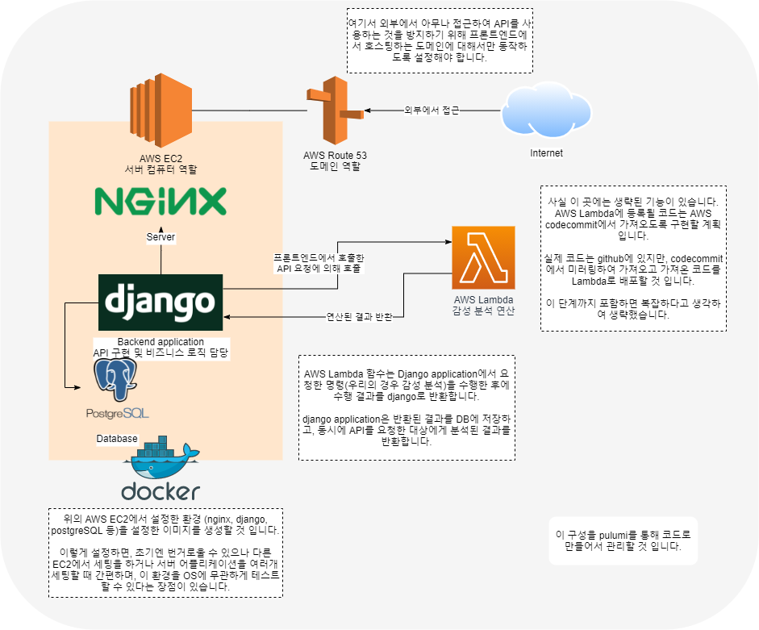

# J2KB news reply sentiment analysis

## Summary

이 곳은 **news reply sentiment analysis** 프로젝트 저장소입니다.  
`frontend`, `backend`, `infra`, `ai`들을 **submodule**로 포함하고 있습니다.  

또한 이 프로젝트는 [j2kb](https://www.j2kbcoding.com/)라는 개발 커뮤니티의 **포니콘(pony-con)** 프로젝트입니다.

## Stack

- Django
- ReactJS
- Database not specified

## Contents

- presentation pdf
- related repo as submodule

## Collaborator

|  |  |  |  |  |  |
| :----------------------------------------------------------------------------------------------------------: | :---------------------------------------------------------------------------------------------------------: | :----------------------------------------------------------------------------------------------------------: | :---------------------------------------------------------------------------------------------------------: |:---------------------------------------------------------------------------------------------------------: |:---------------------------------------------------------------------------------------------------------: |
|                                                   Dan Kim                                                    |                                                Minsik Hwang                                                 |                                                  Sumin Wee                                                   |                                                  Donwhi Na                                                  |                                                 Gayoung Kim                                                  |                                                 Han Ki In                                                  |
|                                                   backend                                                    |                                                  frontend                                                   |                                                   designer                                                   |                                                   backend                                                   |                                                  ml                                                   |                                                  backend                                                   |

---

## Contributors

---

## References

### Architecture diagram

